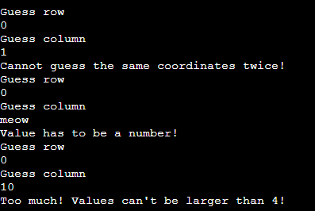

# Battleships

The popular battleships game is making a comeback as a text based version completely made up of Python. Battleships is a simple but entertaining game simulating a naval battle where you use artillery to bombard coordinates at sea to try and hit enemy battleships. Due to its simple nature the game can be enjoyed by people of all ages and can be a good way to relax after a period of work without using too much of the user's energy and attention. Many games can be addictive and draining but this scaled down version gives the user a dosage of fun without the negative side effects. Battleships can also be used for educational purposes to learn about coordinates.

## Features

### The Start Up 

When you start the program you are welcomed with some useful information about the game, namely the dimensions and location of the 0, 0 position. The user is also prompted to enter their name.

The game consists of a game board with 5x5 squares filled with 4 pieces of 1x1 ships. The 0, 0 position is at the top left hand corner of the board.

### The Set Up

Once you have entered your name the game will automatically and randomly fill the player- as well as the computer board with ships and renders both boards to the user. The player ships will be visible while the computer's ships will be hidden.

### Guess and validation

The player is then asked to enter two numbers, one guess for the row and one guess for the column to where the player guesses the computer's ships are hiding. In order for the game to work the guesses have to be validated in accordance with the parameters of the game, which are that it needs to be a whole number between 0-4, and not the same coordinates as one the player has made before. Once a valid guess has been made the turn ends with scoring. 

### Scoring

The computer guess is a randomized coordinate and together with the player guess they are measured against the ships on each of the two boards. If the coordinates of the guess corresponds with the coordinates of a ship you gain one point. 

Welcome,

This is the Code Institute student template for deploying your third portfolio project, the Python command-line project. The last update to this file was: **March 14, 2023**

## Reminders

- Your code must be placed in the `run.py` file
- Your dependencies must be placed in the `requirements.txt` file
- Do not edit any of the other files or your code may not deploy properly

## Creating the Heroku app

When you create the app, you will need to add two buildpacks from the _Settings_ tab. The ordering is as follows:

1. `heroku/python`
2. `heroku/nodejs`

You must then create a _Config Var_ called `PORT`. Set this to `8000`

If you have credentials, such as in the Love Sandwiches project, you must create another _Config Var_ called `CREDS` and paste the JSON into the value field.

Connect your GitHub repository and deploy as normal.

## Constraints

The deployment terminal is set to 80 columns by 24 rows. That means that each line of text needs to be 80 characters or less otherwise it will be wrapped onto a second line.

---

Happy coding!
