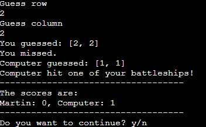

# Battleships

The popular battleships game is making a comeback as a text based version completely made up of Python. Battleships is a simple but entertaining game simulating a naval battle where you use artillery to bombard coordinates at sea to try and hit enemy battleships. Due to its simple nature the game can be enjoyed by people of all ages and can be a good way to relax after a period of work without using too much of the user's energy and attention. Many games can be addictive and draining but this scaled down version gives the user a dosage of fun without the negative side effects. Battleships can also be used for educational purposes to learn about coordinates.

## Features

### Exisiting features:

#### The Start Up 

When you start the program you are welcomed with some useful information about the game, namely the dimensions and location of the 0, 0 position. The user is also prompted to enter their name.

The game consists of a game board with 5x5 squares filled with 4 pieces of 1x1 ships. The 0, 0 position is at the top left hand corner of the board.

#### The Set Up

Once you have entered your name the game will automatically and randomly fill the player- as well as the computer board with ships and renders both boards to the user. The player ships will be visible while the computer's ships will be hidden.

#### Guess and validation

The player is then asked to enter two numbers, one guess for the row and one guess for the column to where the player guesses the computer's ships are hiding. In order for the game to work the guesses have to be validated in accordance with the parameters of the game, which are that it needs to be a whole number between 0-4, and not the same coordinates as one the player has made before. Once a valid guess has been made the turn ends with scoring. 

#### Scoring

The computer guess is a randomized coordinate and together with the player guess they are measured against the ships on each of the two boards. If the coordinates of the guess corresponds with the coordinates of a ship you gain one point. The player then has to type in either "y" for yes or "n" for continuing the game. 

#### Game boards and new round

Once the player moves on to the next round the game boards are rendered in the terminal so as to show which coordinates have already been guessed and the status of the player's own ships. The following symbols are used:

"." - empty coordinate without ship on player board and without a guess on computer board.

"X" - coordinate which have been guessed and shot at.

"*" - coordinate which have been guessed and a ship has been hit.

### Features left to implement

- Different sizes of game boards to choose from.
- Different sizes of ships to choose. 

## Testing

The code has been tested thoroughly through the coding process, both on the deployed Heroku Terminal as well as the IDE terminal. It has also cleared the PEP8 validator without any significant issues. 

### Validator testing

The code has been tested through PEP8 validator without significant issues. However a couple lines are too long but it does not change the functionality of the program. 

### Bugs

#### Fixed bugs

- Solved a bug where I had to add another argument to the validate_coordinates function in order to access the size of the board and the guesses.
- Solved a bug where the player_board and computer_board class instances were mixed up in the scoring, making the board rendering faulty. 

#### Unfixed bugs

- No unsolved bugs.

## Deployment

The project was deployed with Code Institute's Heroku Terminal.

Steps for deployment:

1. Create new app
2. Add Config Vars PORT: 8000
3. Set buildpacks to Python and Node.js in that order. 
4. Access repository from GitHub
5. Click deploy

You can find the deployed version [here](https://martin-battleships-c08f67c1bf63.herokuapp.com/)

## Credits

- Code Institute Mock Terminal for Heroku
- Code Institute Battleships tutorial